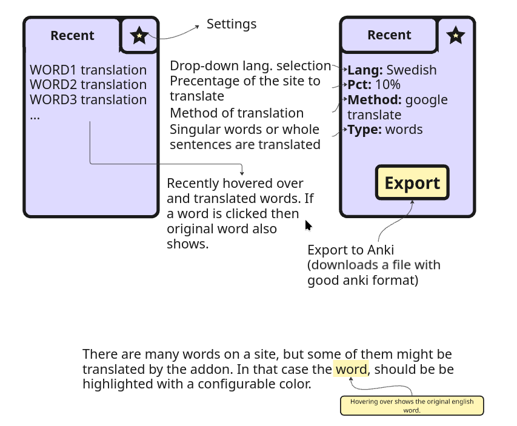
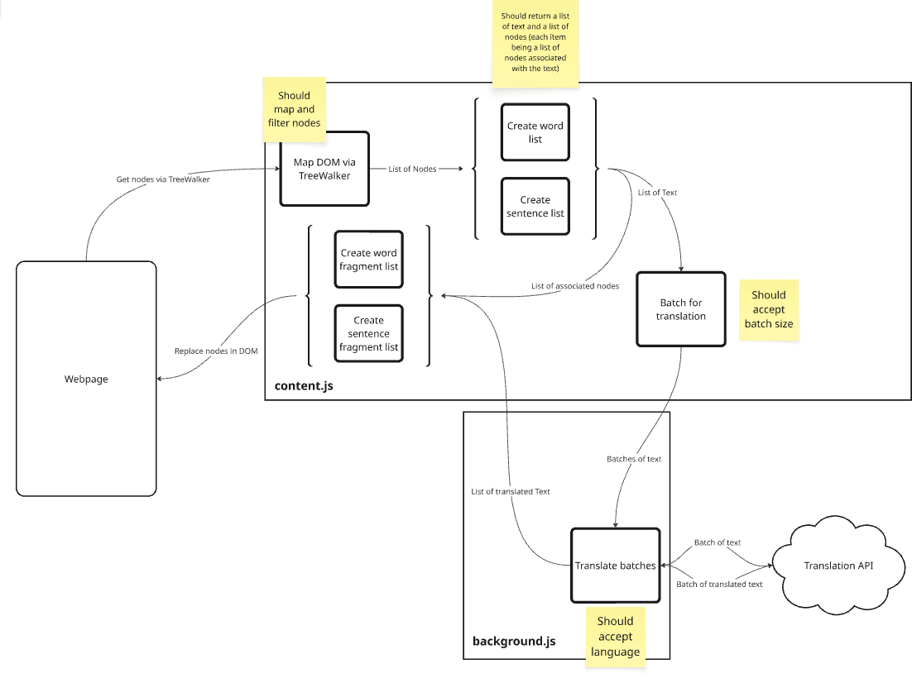

# FloodLang

### by Dániel Veress

FloodLang was created to flood every website you look at with the language you want to learn. My hope with this project is to create a small extension that helps with expanding your vocabulary.

The motivation was simple. You can easily translate whole websites, or parts of it, but it is very manual and the difficulty of a whole site being translated is greater than just a few words or sentences. The extension is not developed to solve everything that is needed for language learning, but it is another tool that one can use.

## Features

- Automatic word translation
- Languages
- Translation highlight and hover-over functionality to look at original words
- Save and delete original text and translation
- Clear all saved translation pairs

### Planned Features

#### Translation & Language

- **Sentence-scoped translation** — translate full sentences instead of isolated words, preserving grammar and context
- **LLM-based translation backend** — use a language model (e.g. Claude, GPT-4) as an alternative to Google Translate for more natural, context-aware output
- **Custom API key input** — let users enter their own Google Translate or LLM API key directly in the popup, removing the need for a local `config.js`
- **Expanded language support** — add all Google Translate–supported languages to the target language dropdown, not just the current 3

#### Vocabulary & Learning

- **Anki export** — export the saved vocab list as an Anki-compatible `.apkg` or CSV deck for spaced-repetition study outside the browser
- **Spaced repetition within the extension** — prioritize showing words the user has seen fewer times, or hasn't hovered over recently, to reinforce recall over time
- **Click to reveal original** — clicking a translated word toggles it back to the original inline, instead of only showing the original on hover
- **Word difficulty scoring** — track how many times a word has been seen and mark it as "learned" after enough exposures, reducing its replacement probability

#### UI & Customization

- **Highlight styles** — offer alternatives to red text: underline, background color, tooltip bubbles, or a subtle dashed border
- **Per-site enable/disable** — allow users to whitelist or blacklist specific domains so the extension only runs where wanted
- **Floating vocab panel** — a small persistent overlay on the page showing recent word pairs without opening the popup
- **Keyboard shortcut to toggle** — quickly enable or disable word replacement on the current page without opening the popup

#### Technical

- **Injection on dynamic content** — use a `MutationObserver` to handle SPAs and infinite-scroll pages where content loads after the initial page render
- **Source language detection display** — show users what language was detected on the page
- **Offline / local model support** — integrate a small local translation model so the extension works without an internet connection or API key

## Prototype plan

